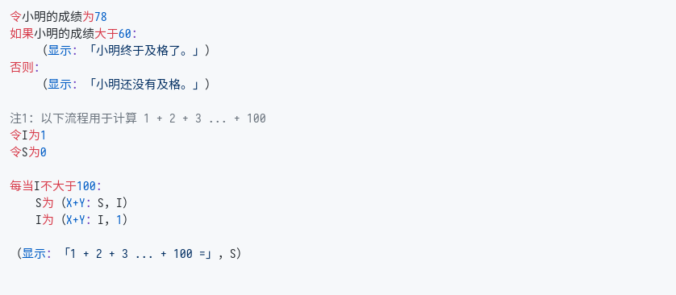

# Zn
_千里之行，始于足下。_

## 简介

`Zn` 是一门 _面向业务_ 的编程语言。

所谓「面向业务」，即是为用户开发业务代码时提供便利，使得用户能够编写出快速、稳定、可维护的代码以实现需求。和其他「面向计算机」的编程语言不同，`Zn` 更加强调「以人为本」，希望程序能够适应真实世界的需求而不是反过来。

为此，`Zn` 拥有以下独特的特性：

- 采用 **中文关键词、标点符号**。这样再也不用为「用英文命名变量」之事发愁了。
- 默认使用 **高精度小数** 作为数值并参与运算，杜绝因浮点数计算所带来的计算误差。
  > 这一点对开发金融应用尤为关键。显然，诸如 `0.1 + 0.2 = 0.30000000000000004` 这样的结果在金融应用中是无法忍受的。
- 贴近汉语本身语法，阅读代码可以像阅读文章一样自然。
- 关键词之间不必用空格间断。

## 快速开始

_注1：`Zn` 采用 Go 语言开发，安装前请确保 Go 语言编译器已安装在机器上。（建议版本 `>= 1.11`）_  
_注2：因为GitHub暂不支持对 Zn 进行语法高亮，为保证显示效果，以下代码皆用截图显示。_

### 下载及安装
```sh
# 下载 Zn 语言
$ git clone https://github.com/DemoHn/Zn.git

# 编译相应的文件
# 如果不方便运行 shell 脚本 （如使用 Windows 操作系统），用以下命令替代亦可
# cd Zn
# go build -o zn
# go build -o znt ./cmd/znt
$ cd Zn && ./build.sh

# 查看 Zn 语言版本
$ ./zn -v
```

### 进入交互模式

Zn 支持在命令行中以交互的方式返回结果（亦即REPL）。在命令行中直接输入 `zn` ，即可进行交互模式。

交互模式运行时，当前行的前面会显示 `Zn>` 做为标识符。在 `>` 号后即可直接输入完整的表达式或者语句。如果中途发现有地方需要修改，即可使用 `左方向键` 及 `右方向键` 移动光标到对应的位置以编辑；输入完成后，敲击回车键即可直接执行，运行结果将直接在后面显示。

以下即为使用交互模式的一个例子，你可以切换到中文输入法，试着体验下：
  > 注1：下文中出现的直角引号 `「 」` 也可以用普通的双引号 `“ ”` 代替，如：  
  > `令BAT为【“字节”，“阿里”，“腾讯”】`，下同 。
  >
  > 注2：按 `Ctrl + C` 即可退出交互执行模式。

```sh
$ ./zn
Zn> 令BAT为【「字节」，「阿里」，「腾讯」】
Zn> 令鹅厂为BAT#2
Zn> （显示：鹅厂）
腾讯
```

### 执行代码

Zn 语言目前亦支持执行某个文件中的程序，其格式为 `zn <待执行文件名>` （如 `zn 快速排序.zn`）。文件路径可以是相对于当前目录的路径，亦可以是绝对路径。

虽然Zn对于待执行文件的后缀名并没有要求，但是这里仍然建议代码文件以 `.zn` 做为后缀名保存。

> ⚠️ 代码文件须以 `utf-8` 编码储存，若以其他编码（包括`gb2312`, `gbk`）执行文件将会报错。

### 语法简介

#### 变量声明及赋值

Zn 允许并鼓励使用中文变量名

- 
：`令 〔变量名〕 为 〔值〕`


变量须先声明，方可继续使用。

2. 对变量赋值：`〔变量名〕 为 〔值〕`


`进站人次-累计` 为变量名（`-`也是变量名的一部分）， `1284500` 为值。相当于 `进站人次-累计 := 1284500`

3. 调用方法：`（〔变量名〕：〔参数1〕，...）`


Zn 内置了 `显示` 方法，类似于 `console.log` 或者 `print`。  
`X+Y` 表示对所有参数求和；类似地还有 `X-Y`， `X*Y`， `X/Y`。

4. 流程控制：`如果 〔表达式〕：` 及 `每当 〔表达式〕：`



Zn 采用类似 Python 的方式，即是以缩进表示语法块。一个单位缩进为 `4个空格` 或者 `1个TAB`。同一个文件里的缩进类型要么都是空格，要么都是TAB，不能混用。

对于 `如果` 语句而言，若是后面的表达式值为 `真`，则执行「如果」后面的语句块；若为 `假`，则执行「否则」后面的语句块。

对于 `每当` 语句而言，当后面的表达式值为 `真`，则下属语句块会循环往复执行。

5. 定义方法：`如何 〔方法名〕 ？`


定义一个方法（又称函数）以 `如何` 开始，后面跟着要定义的方法名。而后在子语句块的第一项中定义参数列表：`已知 〔参数1〕，〔参数2〕，...`。 `返回`语句定义了执行方法之后所需的返回值。


## 参与开发

TODO

## 了解更多

TODO