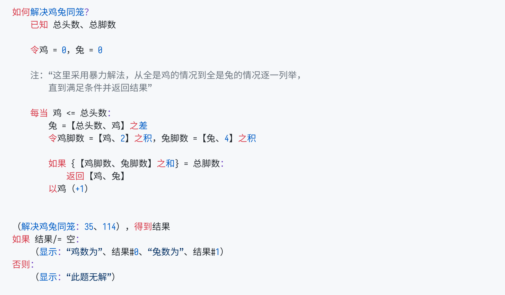
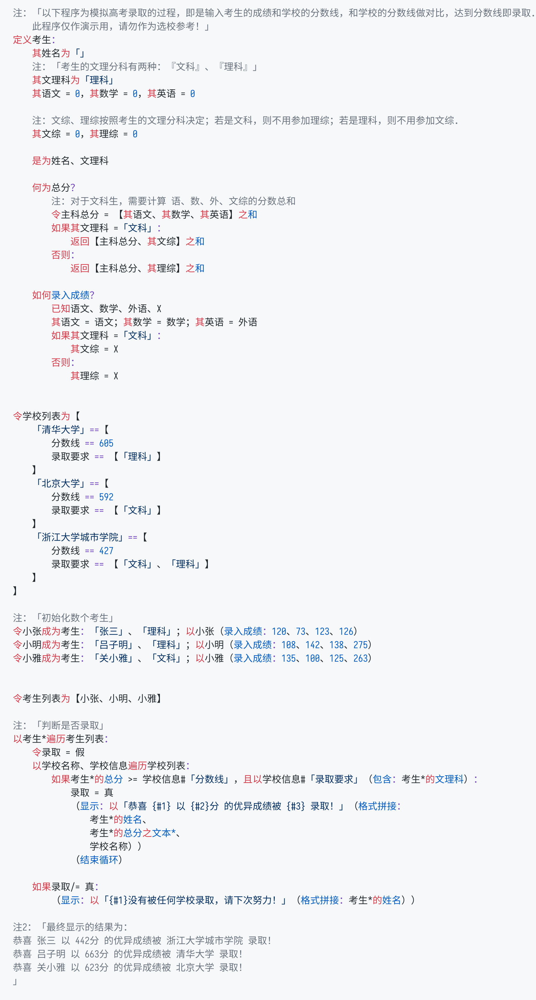

# Zn
_千里之行，始于足下。_

## 简介

`zinc` 是一门 _面向业务_ 的编程语言。

所谓「面向业务」，即是为用户开发业务代码时提供便利，使得用户能够快速根据真实需求投射出简洁、稳定、可维护的代码。`zinc` 在设计之初即强调「以人为本」，希望程序能够适应真实世界的需求而不是让开发者去适应代码逻辑。

为此，`zinc` 拥有以下独特的特性：

- 中文编程，采用 **中文关键词及标点**，再也不用为「用英文命名变量」之事发愁了。
- 数值运算默认使用 **高精度运算** ，杜绝因浮点数计算所带来的计算误差。
- 贴近汉语本身语法，阅读代码可以像阅读文章一样自然。
- 关键词之间不必用空格分隔。

## 安装及使用

_注1：`zinc` 采用 Go 语言开发，安装前请确保 Go 语言编译器已安装在机器上。（建议版本 `>= 1.13`）_  
_注2：因为GitHub暂不支持对 Zn 进行语法高亮，为保证显示效果，以下代码皆用截图显示。_

### 下载
```sh
# 下载 及安装 Zn 语言
$ go get github.com/DemoHn/Zn

# 查看 Zn 语言版本
$ zinc -v
```

### 进入交互模式

Zn 支持在命令行中以交互的方式得出结果（亦即REPL）。在命令行中直接输入 `zinc` ，即可进行交互模式。

交互模式运行时，当前行的前面会显示 `Zn>` 做为标识符。在 `>` 号后即可直接输入完整的表达式或者语句。如果中途发现有地方需要修改，即可使用 `左方向键` 及 `右方向键` 移动光标到对应的位置以编辑；输入完成后，敲击回车键即可直接执行，运行结果将直接在后面显示。

以下即为使用交互模式的一个例子，你可以切换到中文输入法，试着体验下：  
  > 注：按 `Ctrl + C` 即可退出交互执行模式。

```sh
$ ./zinc
Zn> 15 + 25
40
```

### 运行代码文件

Zn 语言目前亦支持执行某个文件中的程序，其格式为 `zinc <文件名>` （如 `zinc 快速排序.zn`）。文件路径可以是相对于当前目录的路径，亦可以是绝对路径。

Zn 对于文件后缀名并没有要求，但是这里仍然建议代码文件以 `.zn` 做为后缀名保存。

> ⚠️ 代码文件须以 `utf-8` 编码储存，若以其他编码（包括`gb2312`, `gbk`）执行文件将会报错。

## 语法教程
    
  - 点击 [快速开始](doc/zh-cn/manual/快速开始.md) 以快速了解并学习 Zn 的基本语法。  
  - 点击 [用户手册](doc/zh-cn/manual/README.md) 以查找 Zn 的全部语法等技术细节。 _TODO: 需要补全及修订内容_

## 示例代码

1. 解决「鸡兔同笼」问题



2. 模拟高考录取判定流程



## 开发清单

- [ ] 完成用户手册的编写 (rev04)
- [X] 补充 `exec` 模块的单元测试
- [X] 开发 `Zn for VSCode` 插件，支持语法高亮
- [X] 添加数据类型的常用方法
- [X] 添加 `对于` 关键字 (rev05)
- [ ] 添加异常处理 (rev05)
- [ ] 添加 call stack (rev07)
- [X] 添加循环依赖检测 (rev07)

> 版本说明：Zn 语言一开始从 rev01 一路开发至 rev07，每个 rev 之间语法会有较大的差异，请以
> 最新的代码实现以及文档为准.
>
> 预计在 rev08 完成之后，版本将会升级至 v0.1，此时语法将会基本定形，但是标准库和 API 不会向下兼容
>
> 预计从 v1.0 起会公开发布正式版，此时 语法调整、标准库及API 不会随意删减（但是会添加），调整时会向下兼容
> v1.0 起的版本将会是稳定版本.

## 开源许可

此软件采用 `BSD-3` 开源许可，敬请注意其适用范围：

```
Copyright (c) 2020, Zn Dev Group
All rights reserved.

Redistribution and use in source and binary forms, with or without
modification, are permitted provided that the following conditions are met:
    * Redistributions of source code must retain the above copyright
      notice, this list of conditions and the following disclaimer.
    * Redistributions in binary form must reproduce the above copyright
      notice, this list of conditions and the following disclaimer in the
      documentation and/or other materials provided with the distribution.
    * Neither the name of the Zn dev group nor the
      names of its contributors may be used to endorse or promote products
      derived from this software without specific prior written permission.

THIS SOFTWARE IS PROVIDED BY THE COPYRIGHT HOLDERS AND CONTRIBUTORS "AS IS" AND
ANY EXPRESS OR IMPLIED WARRANTIES, INCLUDING, BUT NOT LIMITED TO, THE IMPLIED
WARRANTIES OF MERCHANTABILITY AND FITNESS FOR A PARTICULAR PURPOSE ARE
DISCLAIMED. IN NO EVENT SHALL ZN DEV GROUP BE LIABLE FOR ANY
DIRECT, INDIRECT, INCIDENTAL, SPECIAL, EXEMPLARY, OR CONSEQUENTIAL DAMAGES
(INCLUDING, BUT NOT LIMITED TO, PROCUREMENT OF SUBSTITUTE GOODS OR SERVICES;
LOSS OF USE, DATA, OR PROFITS; OR BUSINESS INTERRUPTION) HOWEVER CAUSED AND
ON ANY THEORY OF LIABILITY, WHETHER IN CONTRACT, STRICT LIABILITY, OR TORT
(INCLUDING NEGLIGENCE OR OTHERWISE) ARISING IN ANY WAY OUT OF THE USE OF THIS
SOFTWARE, EVEN IF ADVISED OF THE POSSIBILITY OF SUCH DAMAGE.
```